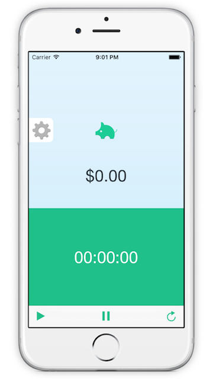

# Wage Calculator

In development app iOS and Mac application that allows you to keep track of how fast you're earning money.

Pre-requisites
--------------
- Swift 2

Screenshots
-----------

Android Version
--------------
https://github.com/steveholt55/Wage-Calculator-Android

License
---------------
This project is released under the MIT license. See LICENSE for details.
